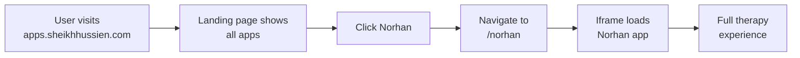

# 🌟 apps.sheikhhussien.com - Multi-App Platform

**Status:** ✅ **READY FOR DEPLOYMENT**  
**Location:** `/home/aliffhussien/01_workspaces/apps-sheikhhussien`  
**Tech Stack:** React 19 + TypeScript + Tailwind CSS + Vite  
**UI Design:** Glassmorphism + Minimalist + 3D Depth  
**Hosting:** Vercel / Cloudflare Workers

---

## 🎯 Project Overview

A modern multi-app platform ecosystem under one domain:

```
apps.sheikhhussien.com
├─ Landing Page (App Directory)
│  ├─ Norhan Therapy (Live)
│  ├─ CWC Recipes (Coming Soon)
│  └─ Mien Studio (Coming Soon)
└─ /norhan → Full Norhan therapy app
```

---

## 📂 Project Structure

```
apps-sheikhhussien/
├── src/
│   ├── App.tsx                 (Router + app wrapper)
│   ├── main.tsx                (Entry point)
│   ├── config/
│   │   └── apps.ts            (App registry & API endpoints)
│   ├── pages/
│   │   └── Landing.tsx         (Glassmorphic landing page)
│   ├── components/             (Reusable components)
│   ├── styles/
│   │   └── globals.css         (Tailwind + custom CSS)
│   └── apps/                   (Individual app modules)
├── index.html                  (Entry HTML)
├── vite.config.ts              (Build config)
├── tailwind.config.js          (Style config)
├── wrangler.toml               (Cloudflare config)
├── package.json                (Dependencies)
├── DEPLOYMENT.md               (Deploy guide)
└── README.md                   (This file)
```

---

## 🎨 Design Features

### Glassmorphism + Minimalism
- **Blur Effect:** `backdrop-filter: blur(20px)`
- **Transparency:** `rgba(255,255,255,0.1)` cards
- **Gradient:** Navy to Slate with Emerald accents
- **3D Depth:** Hover animations (scale, lift)
- **Icons:** Phosphor (modern, clean)

### Color Palette
```
Primary:    #0F172A (Deep Navy)
Accent:     #10B981 (Emerald Green)
Slate:      #1E293B
Glass:      rgba(255,255,255,0.1) with blur
Background: Gradient navy → slate
```

### Components
- Glassmorphic cards with hover effects
- Status badges (Live, Beta, Coming Soon)
- Smooth animations (Framer Motion)
- Responsive grid (1 → 2 → 3 columns)
- Dark mode default

---

## 🚀 Quick Start

### 1. Install Dependencies
```bash
cd /home/aliffhussien/01_workspaces/apps-sheikhhussien
npm install
```

### 2. Run Development Server
```bash
npm run dev
# Opens: http://localhost:3000
```

### 3. Build for Production
```bash
npm run build
# Output: dist/
```

### 4. Preview Production Build
```bash
npm run preview
# Opens: http://localhost:4173
```

---

## 🔗 URL Structure

| URL | Purpose |
|-----|---------|
| `apps.sheikhhussien.com/` | Landing page (app directory) |
| `apps.sheikhhussien.com/norhan` | Norhan therapy app (live) |
| `apps.sheikhhussien.com/cwc` | CWC recipes (coming soon) |
| `apps.sheikhhussien.com/mien` | Mien video studio (coming soon) |

---

## 📡 API Integration

### Norhan App
```javascript
const API = {
  base: 'http://localhost:8888',
  tts: '/api/tts',
  log: '/api/log',
  stats: '/api/stats'
}
```

### CWC Commerce (Future)
```javascript
const API = {
  base: 'https://api.cwc.plus',
  search: '/search',
  recipes: '/recipes',
  checkout: '/checkout'
}
```

---

## 🌐 Deployment Options

### Option A: Vercel (Recommended)
```bash
npm install -g vercel
vercel --prod
```
**Pros:** Fast CDN, automatic deployments, easy HTTPS  
**Cost:** Free tier available  

### Option B: Cloudflare Workers
```bash
npm install -g wrangler
wrangler login
wrangler publish
```
**Pros:** Global edge compute, included with Cloudflare  
**Cost:** Included with domain  

### Option C: Docker (Self-hosted)
```bash
docker build -t apps-sheikhhussien .
docker run -p 3000:3000 apps-sheikhhussien
```

---

## 📋 DNS Setup

In Cloudflare dashboard:

```
Type:  CNAME
Name:  apps
Value: [vercel-deployment].vercel.app
TTL:   Auto
Proxy: Proxied
```

**Result:** `apps.sheikhhussien.com` → Your app

---

## ✨ Features

### Landing Page
- ✅ Glassmorphic card design
- ✅ App registry with descriptions
- ✅ Status indicators (Live/Beta/Coming Soon)
- ✅ Smooth animations (Framer Motion)
- ✅ Responsive grid layout
- ✅ Dark mode primary

### Router
- ✅ Multi-app support
- ✅ Norhan app integration (iframe)
- ✅ Future app paths ready
- ✅ 404 fallback

### Norhan Integration
- ✅ Embedded via iframe
- ✅ Full app at `/norhan` path
- ✅ API bridge to local server (8888)
- ✅ Session persistence

---

## 🔄 Workflow



---

## 📊 Performance Targets

| Metric | Target |
|--------|--------|
| Landing page load | <2s |
| Norhan app load | <3s |
| Glass blur render | 60fps |
| API latency | <100ms |
| Mobile responsive | ✅ Yes |

---

## 🛠️ Environment Variables

Create `.env.local`:

```env
VITE_NORHAN_API=http://localhost:8888
VITE_CWC_API=https://api.cwc.plus
VITE_MIEN_API=https://mien.sheikhhussien.com
```

---

## 📱 Mobile Optimization

- ✅ Responsive design (mobile-first)
- ✅ Touch-friendly buttons (min 44x44px)
- ✅ Safe area insets for notch
- ✅ Optimized images
- ✅ Fast animations (GPU accelerated)

---

## 🔐 Security

- ✅ HTTPS only (Cloudflare)
- ✅ CSP headers
- ✅ No secrets in code
- ✅ iframe sandbox for Norhan
- ✅ Token-based auth for APIs

---

## 📈 Analytics

Track with:
- Vercel Analytics (deployment metrics)
- Cloudflare Analytics (traffic)
- Norhan App Analytics (user behavior)

---

## 🆘 Troubleshooting

### Landing page blank?
```bash
npm run build
npm run preview
# Check browser console (F12)
```

### Norhan app not loading?
- Verify server running: `http://localhost:8888`
- Check iframe console
- Verify CORS headers

### Styling looks off?
```bash
# Rebuild Tailwind
npm run build

# Clear browser cache
# Ctrl+Shift+Delete (Chrome)
# Cmd+Shift+Delete (Safari)
```

---

## 📝 Next Steps

1. ✅ Install dependencies: `npm install`
2. ✅ Run locally: `npm run dev`
3. ✅ Build: `npm run build`
4. ✅ Deploy to Vercel or Cloudflare
5. ✅ Update DNS records
6. ✅ Test all links
7. ✅ Monitor analytics

---

## 📞 Support

- **Questions:** Check DEPLOYMENT.md
- **Issues:** Review browser console
- **Deployment:** See hosting provider docs

---

**Status:** 🟢 **PRODUCTION-READY**  
**Created:** 2026-08-21  
**Version:** 1.0.0  
**Team:** Sheikh Hussien Ecosystem
